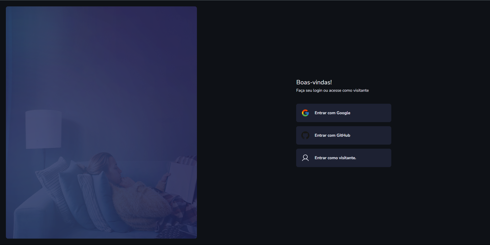
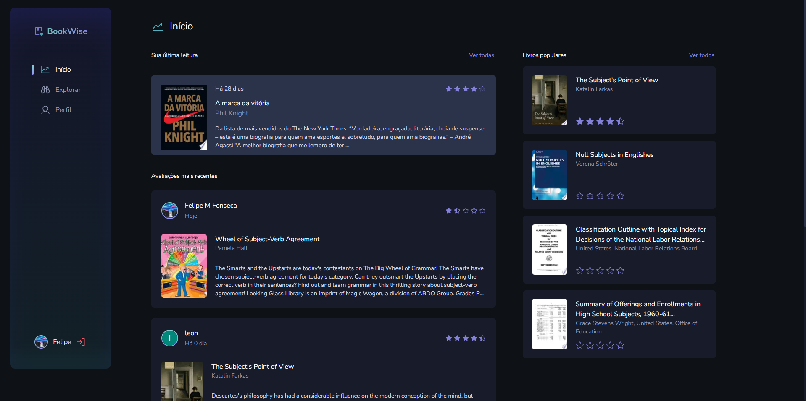

# 📚 BookWise

Projeto desenvolvido como parte da **trilha React Ignite da Rocketseat**, com foco na construção de uma aplicação moderna, interativa e conectada ao ecossistema Google Books.

> 🔗 **Acesse o projeto online:**  
> 👉 [https://book-wise-ten-liart.vercel.app](https://book-wise-ten-liart.vercel.app)


## ✨ Funcionalidades

- 🔐 Autenticação via Google e GitHub
- 📝 Avaliação e registro de livros lidos
- 📊 Visualização das avaliações mais recentes da comunidade
- 📚 Integração com o **Google Livros**
- 👤 Perfil com informações do usuário
- 🔍 Exploração de livros populares por categoria


## 📷 Imagens da aplicação

##### Tela de Login:



##### Feed Principal:


Essas imagens representam:

- A tela de login com opções de entrada via Google, GitHub ou como visitante.
- O feed principal, com avaliações recentes da comunidade e livros populares com barra lateral de navegação.

> 📁 As imagens estão localizadas na pasta `public/screens/`.
---

## 🚀 Tecnologias e ferramentas

- **Next.js 15** (`app/` directory, Turbopack)
- **React 19**
- **TypeScript**
- **Prisma ORM + PostgreSQL**
- **NextAuth.js** com OAuth (Google e GitHub)
- **React Query** (`@tanstack/react-query`)
- **Zustand** para estado global
- **Framer Motion** para animações
- **Tailwind CSS**
- **MUI (Material UI)** + Emotion (estilização)
- **Phosphor Icons**
- **Google APIs** (Books API e OAuth)
- **Day.js** para manipulação de datas
- **node-cron** para tarefas agendadas
- **Axios** para requisições

---

## 🛠 Instalação e execução local

```bash
# Clone o repositório
git clone https://github.com/seu-usuario/bookwise.git
cd bookwise

# Instale as dependências
npm install

# Configure o arquivo .env
.env
```

Preencha o .env com suas variáveis (Google, GitHub, PostgreSQL, etc.)
```env
DATABASE_URL=...
DIRECT_URL=...
GOOGLE_CLIENT_ID=...
GOOGLE_CLIENT_SECRET=...
GITHUB_CLIENT_ID=...
GITHUB_CLIENT_SECRET=...
NEXTAUTH_SECRET=...

```

## 🌐 Deploy

A aplicação está hospedada na Vercel e pode ser acessada em:

👉 https://book-wise-ten-liart.vercel.app

Certifique-se de configurar suas variáveis de ambiente no painel da Vercel:

DATABASE_URL

DIRECT_URL

NEXTAUTH_URL (ex: https://book-wise-ten-liart.vercel.app) - Essa variavel foi usada direto no deploy da Vercel, pois para o aplicativo em produção foi criado uma outra aplicação no painel do GitHub (🔗 https://github.com/settings/developers), para poder trabalhar em no modo desenvolvimento sem problema.

GOOGLE_CLIENT_ID e GOOGLE_CLIENT_SECRET

GITHUB_CLIENT_ID e GITHUB_CLIENT_SECRET

NEXTAUTH_SECRET

⚠️ Adicione prisma generate ao seu script de build para evitar erros:

```json
"build": "prisma generate && next build"
```

### 📅 Cron Jobs


Este projeto utiliza node-cron para tarefas agendadas. O script principal de execução está em:

```bash
npm run cron
# Executa scripts/cron-runner.ts
```

## 🧠 Aprendizados

Durante o desenvolvimento, foram trabalhados conceitos como:

* Fullstack com Next.js (SSR + API Routes)

* Integração OAuth 2.0

* Manipulação de permissões com Google APIs

* Estado global com Zustand

* Uso avançado de Prisma com adaptadores customizados